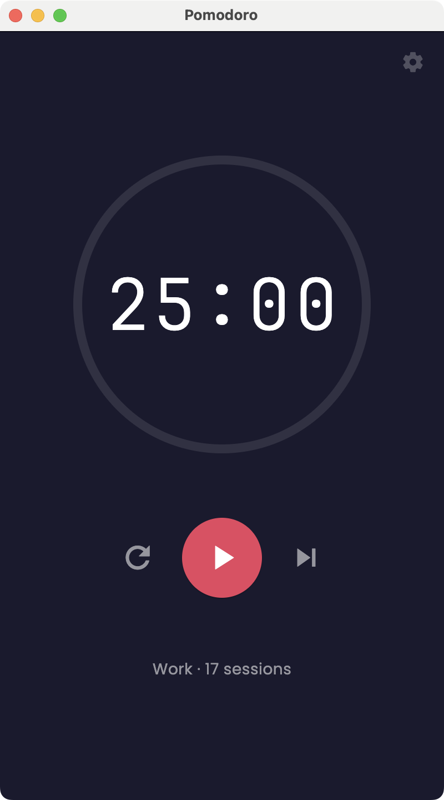
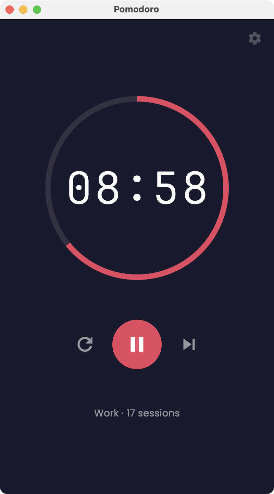
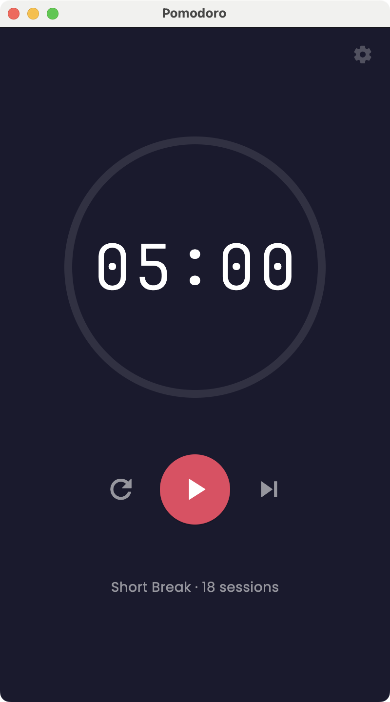
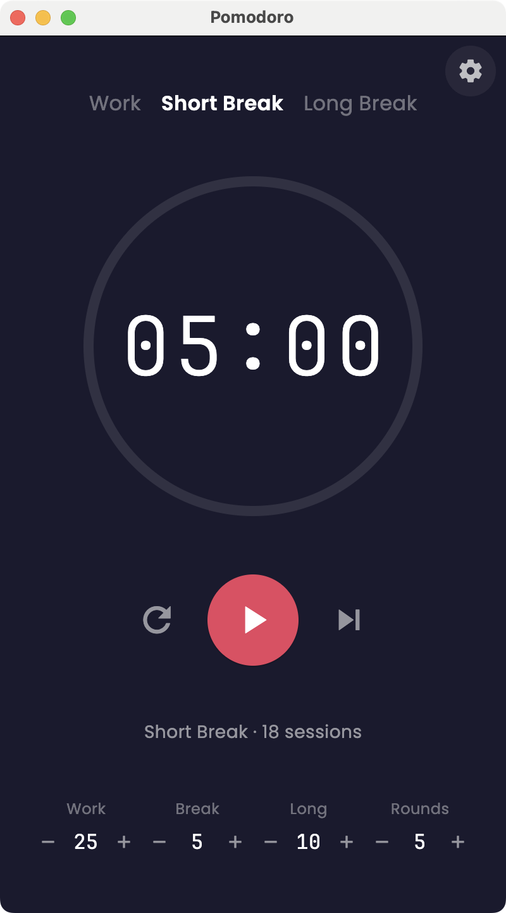

# Pomodoro Timer

A dead-simple, cross-platform Pomodoro Timer. Nothing more, nothing less.

## Screenshots

| Work session | In progress |
| :---: | :---: |
|  |  |
| **Short break** | **Settings** |
|  |  |

## Philosophy

This app is intentionally bare-bones. No accounts, no analytics, no cloud sync, no bloat. Just a timer that helps you focus.

- **Super basic by design.** This is not trying to be a full productivity suite. It's a timer with a start button. That's the point.
- **Completely vibe coded.** This entire app was built with AI (Claude Code). Every line of code, every design decision, even the sound effects — all generated through conversation. No hand-written code.
- **Small and responsive.** The UI adapts to any window size. Resize it tiny, pin it in a corner, run it fullscreen — it just works. The default view shows only the timer and controls. Settings are tucked behind a gear icon.

## Features

- 25-minute work sessions (adjustable)
- 5-minute short breaks (adjustable)
- 10-minute long break after every 4 sessions (both adjustable)
- Session streak counter
- Sound notifications when timers end
- Start, pause, reset, and skip controls
- Auto-transitions between work and break phases
- Minimal UI — settings hidden until you need them
- **macOS menu bar mode** — a live countdown lives in the menu bar, and the timer keeps running even after you close the window (see below)

## Platforms

- macOS
- Windows
- Linux
- iOS
- Android
- Web

## Getting Started

### Prerequisites

- [Flutter SDK](https://docs.flutter.dev/get-started/install) (3.10+)

### Run (any platform)

```bash
flutter pub get
flutter run
```

Flutter auto-detects available devices. To target a specific platform:

```bash
flutter run -d macos
flutter run -d windows
flutter run -d linux
flutter run -d chrome
flutter run -d ios
flutter run -d android
```

## Building for macOS

### Requirements
- macOS (you must be on a Mac)
- [Xcode](https://apps.apple.com/us/app/xcode/id497799835) (free from the App Store)
- CocoaPods (`brew install cocoapods`)

### Setup

```bash
# Point to full Xcode (not just Command Line Tools)
sudo xcode-select --switch /Applications/Xcode.app/Contents/Developer
sudo xcodebuild -runFirstLaunch

# Add macOS platform support (if not already present)
flutter create --platforms macos .
```

### Build & Run

```bash
flutter run -d macos           # Debug mode with hot reload
flutter build macos             # Release build
```

The built app is at `build/macos/Build/Products/Release/pomodoro.app`.

### Menu bar mode

On macOS the app installs a status-bar item showing a live countdown (e.g. `🍅 24:13`). This means:

- **The timer keeps running when you close the window.** Closing the window (red button) just hides it — the countdown keeps ticking in the menu bar and the app stays alive.
- **Click the menu bar item** for quick controls: Show Timer, Start/Pause, Reset, Skip, and Quit.
- **Reopen the window** any time via *Show Timer* in the menu, or the Dock icon.
- **Quit Pomodoro** from the menu bar to fully exit.

## Building for Windows

### Requirements
- Windows 10 or later (64-bit)
- [Visual Studio 2022](https://visualstudio.microsoft.com/downloads/) (Community edition is free)
  - Install the **"Desktop development with C++"** workload
  - Ensure the Windows 10/11 SDK is selected

### Setup

```bash
# Add Windows platform support
flutter create --platforms windows .

# Verify setup
flutter doctor
```

### Build & Run

```bash
flutter run -d windows          # Debug mode with hot reload
flutter build windows            # Release build
```

The built app is at `build\windows\x64\runner\Release\pomodoro.exe`.

## Building for Linux

### Requirements
- Any modern Linux distribution (Ubuntu, Fedora, Arch, etc.)
- The following packages (Ubuntu/Debian example):

```bash
sudo apt update
sudo apt install clang cmake ninja-build pkg-config libgtk-3-dev liblzma-dev libstdc++-12-dev
```

For Fedora:
```bash
sudo dnf install clang cmake ninja-build gtk3-devel
```

For Arch:
```bash
sudo pacman -S clang cmake ninja gtk3
```

### Setup

```bash
# Add Linux platform support
flutter create --platforms linux .

# Verify setup
flutter doctor
```

### Build & Run

```bash
flutter run -d linux             # Debug mode with hot reload
flutter build linux              # Release build
```

The built app is at `build/linux/x64/release/bundle/pomodoro`.

## Building for Mobile

### iOS (requires macOS)

```bash
# Requires Xcode + CocoaPods (same as macOS setup above)
flutter run -d ios               # Run on simulator
flutter build ios                # Release build (requires Apple Developer account for device)
```

### Android

```bash
# Requires Android Studio + Android SDK
flutter run -d android           # Run on emulator or connected device
flutter build apk                # Release APK
flutter build appbundle          # Release AAB (for Play Store)
```

## Building for Web

```bash
flutter run -d chrome            # Debug mode
flutter build web                # Release build (output in build/web/)
```

## Project Structure

```
lib/
├── main.dart                  # App entry point
├── models/
│   └── timer_state.dart       # Timer phases and settings
├── providers/
│   └── timer_provider.dart    # Timer logic and state management
├── screens/
│   └── timer_screen.dart      # UI
└── services/
    ├── sound_service.dart     # Audio notifications
    └── menu_bar_service.dart  # macOS menu bar item + background/window control
assets/
├── fonts/                     # Bundled fonts (JetBrains Mono, Poppins)
└── sounds/
    ├── work_complete.wav      # Work session end tone
    └── break_complete.wav     # Break end tone
```

## Tech Stack

- **Flutter** — cross-platform UI framework
- **provider** — state management (MIT license)
- **audioplayers** — audio playback (MIT license)
- **shared_preferences** — persistent key-value storage (BSD license)
- **window_manager** — desktop window control, e.g. hide-on-close (MIT license)
- **tray_manager** — menu bar / system tray item (MIT license)
- **JetBrains Mono** — timer font (SIL Open Font License)
- **Poppins** — UI font (SIL Open Font License)

All dependencies are open source. Sound files are programmatically generated sine waves (public domain). No proprietary code or tools.

Session count and settings persist across app restarts. No database — just flat key-value storage via `shared_preferences`.

For detailed technical design, see [ARCHITECTURE.md](ARCHITECTURE.md).

## License

MIT License — see [LICENSE](LICENSE).
